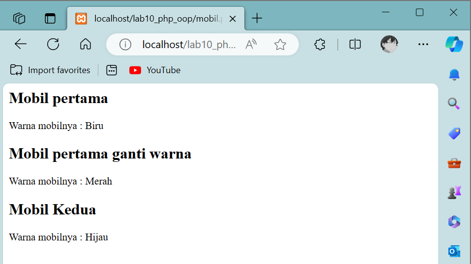

# Lab10Web
Tugas pemrograman WEB PHP OOP #10
## Profil
| Variable | Isi |
| -------- | --- |
| **Nama** | Gilar Sumilar |
| **NIM** | 312210407 |
| **Kelas** | TI.22.A4 |
| **Mata Kuliah** | Pemrograman WEB |

# Instruksi Praktikum
1. Persiapkan text editor misalnya VSCode.
2. Buat folder baru dengan nama lab10_php_oop pada docroot webserver (htdocs).
3. Ikuti langkah-langkah praktikum yang akan dijelaskan berikutnya.

# Pertanyaan dan Tugas
Implementasikan konsep modularisasi pada kode program pada praktukum sebelumnya 
dengan menggunakan class library untuk form dan *database connection*.

- **[link File 1](https://github.com/GilarSumilar/Lab10Web/blob/main/database.php)**
- **[Gambar](https://github.com/GilarSumilar/Lab9Web)**

# Langkah-langkah praktikum
## Buat file baru dengan nama mobil.php

```php
<?php

/**
 * Program sederhana pendefinisian class dan pemanggilan class.
 **/
class Mobil
{
    private $warna;
    private $merk;
    private $harga;

    public function __construct()
    {
        $this->warna = "Biru";
        $this->merk = "BMW";
        $this->harga = "10000000";
    }
    public function gantiWarna($warnaBaru)
    {
        $this->warna = $warnaBaru;
    }
    public function tampilWarna()
    {
        echo "Warna mobilnya : " . $this->warna;
    }
}
// membuat objek mobil
$mobil_pertama = new Mobil();
$mobil_kedua = new Mobil();

// memanggil objek
echo "<h2>Mobil pertama</h2>";
echo $mobil_pertama->tampilWarna();

echo "<h2>Mobil pertama ganti warna</h2>";
echo $mobil_pertama->gantiWarna("Merah");
echo $mobil_pertama->tampilWarna();

echo "<h2>Mobil Kedua</h2>";
echo $mobil_kedua->gantiWarna("Hijau");
echo $mobil_kedua->tampilWarna();

```
**Hasil :**



#### *Note :*

## Buat file baru dengan nama form.php

```php
<?php

/**
 * Nama Class: Form
 * Deskripsi: CLass untuk membuat form inputan text sederhan
 **/
class Form
{
    private $fields = array();
    private $action;
    private $submit = "Submit Form";
    private $jumField = 0;
    public function __construct($action, $submit)
    {
        $this->action = $action;
        $this->submit = $submit;
    }
    public function displayForm()
    {
        echo "<form action='" . $this->action . "' method='POST'>";
        for ($j = 0; $j < count($this->fields); $j++) {
            echo "<tr><td align='right'>" . $this->fields[$j]['label'] . "</td>";
            echo "<td><input type='text'name='" . $this->fields[$j]['name'] . "'></td></tr>";
        }
        echo "<tr><td colspan='2'>";
        echo "<input type='submit' value='" . $this->submit . "'></td></tr>";
        echo "</table>";
    }
    public function addField($name, $label)
    {
        $this->fields[$this->jumField]['name'] = $name;
        $this->fields[$this->jumField]['label'] = $label;
        $this->jumField++;
    }
}

```
**Hasil :**

#### *Note :*
Class library merupakan pustaka kode program yang dapat digunakan bersama pada beberapa 
file yang berbeda (konsep modularisasi). Class library menyimpan fungsi-fungsi atau class 
object komponen untuk memudahkan dalam proses development aplikasi. 

File tersebut tidak dapat dieksekusi langsung, karena hanya berisi deklarasi class. Untuk 
menggunakannya perlu dilakukan include pada file lain yang akan menjalankan dan harus 
dibuat instance object terlebih dulu.

## Buat file baru dengan nama form_input.php

```php
    <?php
    include("from.php");
    ?>

    <!DOCTYPE html>
    <html lang="en">

    <head>
        <meta charset="UTF-8">
        <meta name="viewport" content="width=device-width, initial-scale=1.0">
        <title>Mahasiswa</title>
        <style>
            .container {
                flex-direction: column;
            }

            body {
                font-family: sans-serif;
                background-color: #f4f4f4;
                margin: 0;
                padding: 0;
                display: flex;
                justify-content: center;
                align-items: center;
                min-height: 100vh;
            }

            form {
                background-color: #fff;
                border-radius: 10px;
                box-shadow: 0 0 10px rgba(0, 0, 0, 0.1);
                padding: 20px;
                width: 300px;
                text-align: center;
            }

            h3 {
                color: #333;
            }

            label {
                display: block;
                margin: 10px 0 5px;
            }

            input {
                width: 100%;
                padding: 8px;
                margin-bottom: 10px;
                box-sizing: border-box;
            }

            input[type="submit"] {
                background-color: #21f6ff;
                color: black;
                border-radius: 10px;
                cursor: pointer;
            }

            input[type="submit"]:hover {
                background-color: #50d8de;
            }
        </style>
    </head>

    <body class="container">
        <h3>Silahkan Isi from berikut ini:</h3>

        <?php
        $form = new Form("", "Input Form");
        $form->addField("txtnim", "Nim");
        $form->addField("txtnama", "Nama");
        $form->addField("txtalamat", "Alamat");
        ?>
        <?php $form->displayForm() ?>
    </body>

    </html>
```
**Hasil :**


#### *Note :*

**[---KEMBALI-->](#Profil)**
